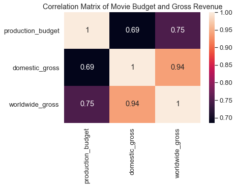

### Overview

For this project, we will use exploratory data analysis to generate insights and recommendations to Microsoft Studios on how to succeed in the movie industry. In our analysis, we will use the following metrics to gauge the perfomance of a movie:

 * Movie Ratings

 * Return on Investment

 * Domestic Gross Revenue 

 * Worldwide Gross Revenue

 * Number of Votes

 * Average ratings

---

### 1. Business Problem

Microsoft sees all the big companies creating original video content and they have decided to join  movie studio industry, but they don't know anything about creating movies. We are charged with exploring what types of films are currently performing  best at the box office. We must then translate those findings into actionable insights that the head of Microsoft's new studio can use to help decide what type of films to create.

---

### 2. Data Understanding
The data used was obtained from three renowned movie websites:

 1. Box Office Mojo (https://www.boxofficemojo.com/) - bom.movie_gross.csv

 2. IMDB (https://www.imdb.com/) - im.db

 3. The Numbers (https://www.the-numbers.com/)- tn.movie_budgets.csv
 
 * From the [first dataset](bom.movie_gross.csv) which is in `.csv` format, we have the title, studios, domestic gross revenue, foreign gross revenue and the year in which the movie was released. We will use data from the studio and domestic gross columns.
 
 * From the [second dataset](im.db) which is in `.db` format, we have a database with 8 tables containing different types of non-monetary information about films such as their directors, writers, and genres, and the ratings . We will use information from movie basics and movie ratings tables.
 
 * From the [third dataset](data/tn.movie_budgets.csv.gz) which is in `.csv` format, we have the names, release dates, production budget, domestic gross revenue and worldwide gross revenue of films that have been released. Here, we use information from the production budget and worldwide gross columns. We calculate correlation of the two and further calculate return on investment using data from the two.

---

### 3. Methods Used

This project uses the following:

 * Statistics 

 * Python
 
 * Numpy

 * Pandas
 
 * Sqlite3
 
 * Jupyter notebook
 
 * Matlplotlib
 
 * Seaborn

---

### 4. Data Visualization

We used the following visualizations:

---

### 5. Recommendations
This analysis leads to the following recommendations for Microsoft Studios:

1. BV Studios had the highest revenues generated by movies produced. Microsoft Studios should consider patnering with them.

2. A majority of production budgets lies between 1,000,000 and 100,000,000. This should be the projected budget for the movie production.

3. The production budget of a movie has a strong impact on the gross revenue generated by the movie.Notwithstanding no.2 above, Micrsosoft Studios should consider increasing their production budget.

4. Releasing movies in December would likely lead to the highest return on investment by the movie but considering other factors too.

5. Movies with a combination of Action, Adventure and Sci-Fi genres were the most popular. Microsoft should produce a movie with this combination of genres so as to perform best.