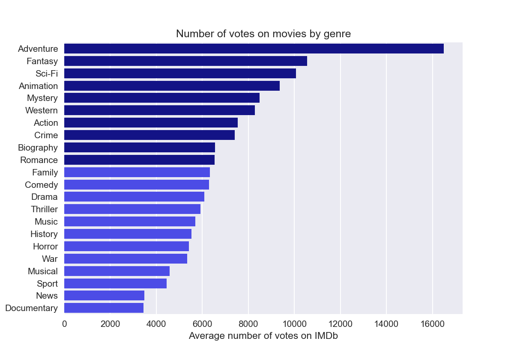
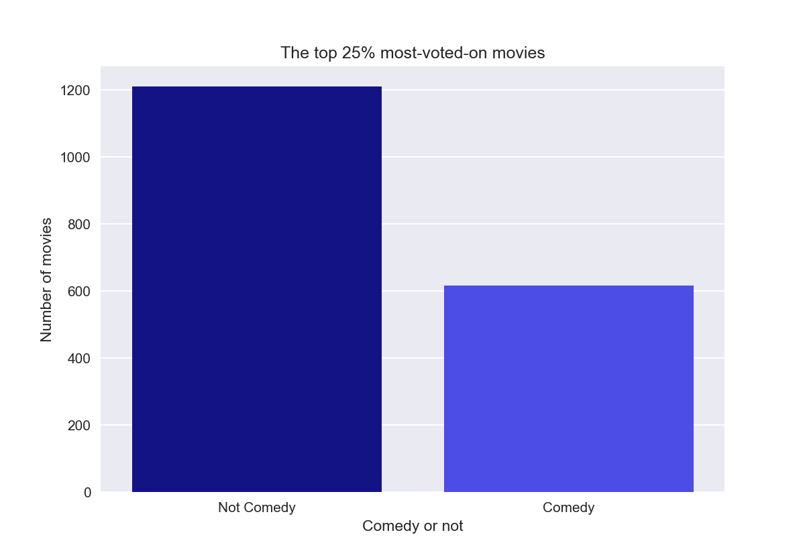
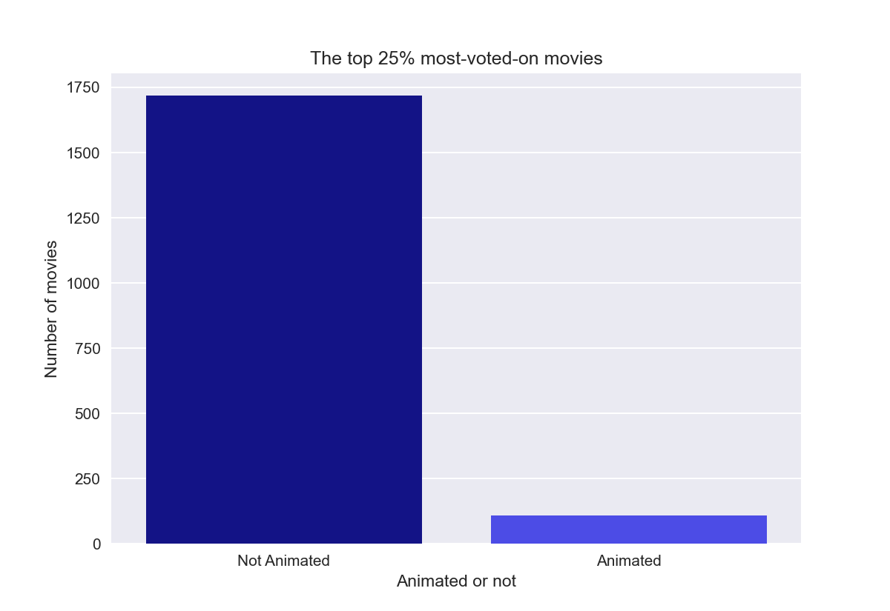

# Microsoft's Foray Into the Movie World
Flatiron School Data Science: Project 1
- **Author**: Zaid Shoorbajee
- **Instructor**: Matt Carr
- **Pace**: Flex, 20 weeks

Image source: [Pixabay](https://pixabay.com/photos/building-cologne-facade-1011876/)

## Overview

This project analyzes data about the ratings and popularity of movies to make recommendations to Microsoft, which intends to launch its own movie studio. As a newcomer to the scene, Microsoft has asked for recommendations on what types of movies perform well among audiences. I have available to me movie datasets from Box Office Mojo, IMDb, Rotten Tomatoes, The Movie Database, and The Numbers. I derive my conclusions mainly from the **IMDb datasets**, which contain information about movies from 2010 to 2019, including, genres, average user rating, and the number of users who voted on each movie. As a result of the analysis, I was able to distill 10 well-peforming genres for Microsoft to focus on, as well as make recommendations about how much of its budget it should focus on 1) comedies and 2) animated movies.

___

## Business Problem

**Measuing success:** A first instict might be to narrow down the attributes of movies that have the highest return-on-investment at the box office. However, in the streaming age, that might not be the best measure of success. Popular movies are increasingly being [released directly to streaming services](https://variety.com/2022/film/box-office/disney-pixar-turning-red-disney-plus-subscribers-1235149836/), and the COVID-19 pandemic has dissuaded many people from going to the theaters anymore. A better measure of success would be the number of people that will actually watch the movie. Whether Microsoft plans to sell its movies to distributors like Netflix or spin up its own streaming service to host the films, it needs to determine what kinds of movies are going to attract the most viewers in numbers.

I use the **number of votes a movie has received** on IMDb as an analogue for the number of viewers. The votes may be negative or positive, but we can infer that a vote means someone actually watched the film. Using this metric, I attempt to answer these questions:

- Which 10 genres tend to perform best?
- How much of Microsoft's budget should it focus on making comedies? 
- How much fo Microsoft's budget should it focus on making animated movies?
___

Image source: [Pixabay](https://pixabay.com/photos/tv-man-watching-room-office-3774381/)

## Data Understanding

IMDb is one of the most popular websites for basic facts about movies and TV shows, as well as user reviews. It claims to have nearly [600,000 movies](https://www.imdb.com/pressroom/stats/) listed and is [ranked 75th](https://www.alexa.com/siteinfo/imdb.com) in in global internet engagement. 

The data I've been provided is housed in a SQL file, from which I primarily use two tables:
- `movie_basics`: Contains information about each movie's name, release year, runtime, and genres.
- `movie_ratings`: Contains a weighted average of all the individual user ratings and the number of votes a movie has received.

More information [here](https://www.imdb.com/interfaces/).

The two tables have a shared column `movie_id`, which is a unique identifier for each movie. I grouped the movies by genre to see each genre's average number of votes.

---

## Measuring Success

I use **number of votes** as an indicator of a movie's of success. In the streaming age, this is arguably a better indicator of a movie's popularity as opposed to return on investment at the box office.

I also found that **number of votes and average rating are positively correlated.** Thus, in choosing number of votes as our measure of success, we are reassured that that it's generally associated with a higher movie rating.

---

## Results: 

### The top 10 movie genres in terms of average number of votes on IMDb are:
- Adventure
- Fantasy
- Sci-Fi
- Animation
- Mystery
- Western
- Action
- Crime
- Biography
- Romance

---

### Of the top 10% best-performing movies, 2,281 out of 7,304 — or 31.22% — are comedies.

---

### Of the top 10% best-performing movies, 287 out of 7,304, — or 3.93% — are animated.

---

## Recommendations

In this analysis I attemped to determine the most successful movie genres as well as what proportions of movies are comedies or animated. I arrived at three recommendations for what kinds of movies Microsoft should make:

1. Microsoft should focus its efforts on movies with some combination of these genres:

    - Adventure
    - Fantasy
    - Sci-Fi
    - Animation
    - Mystery
    - Western
    - Action
    - Crime
    - Biography
    - Romance
    
    
2. Microsoft should focus about a third of its efforts on comedy movies.

3. Microsoft should focus about 4 percent of its efforts on animated movies.
