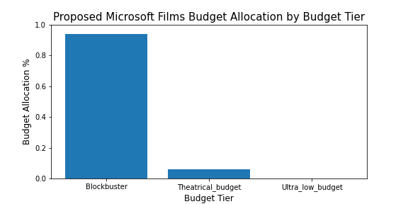
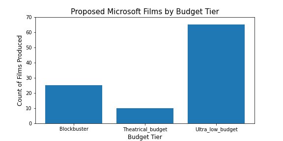
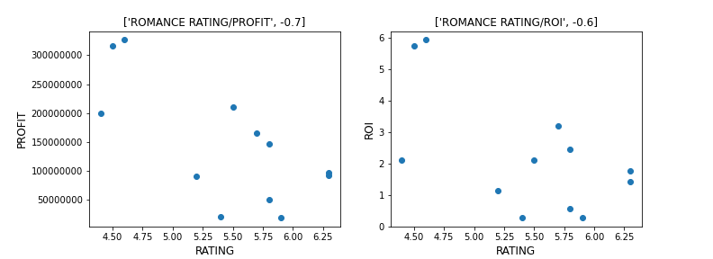
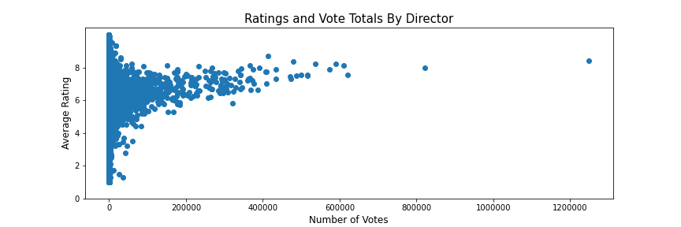
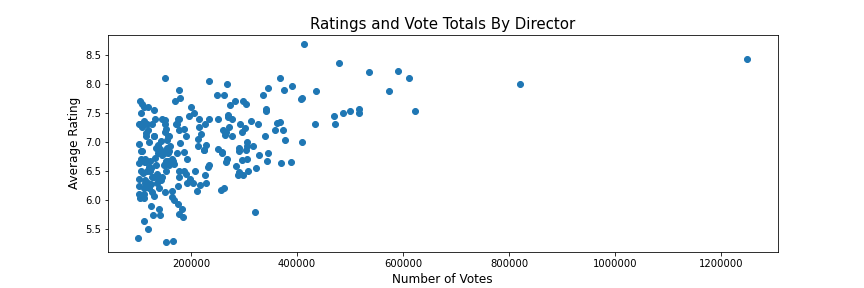

## Overview

  We are looking to provide Microsoft with actionable information regarding high ROI studio projects for Microsoft's new streaming service. The analysis of variables such as budget level, gross box office, ROI, ROI/profit by genre, movie ratings and IMDB ratings by director should help us in deducing useful insights. 

  Our presentation, where we analyze our dataset can be found at:
["Win the Streaming Wars By Minimizing Production Risk"](presentation.pdf)

## Business Understanding

  Some of the insights we hope to discover for Microsoft are optimal budget levels, suggested genres that have a lower risk profile, and optimal directors and writers for this piece of work. Our questions of interest include: what is the optimal budget level for our film?, what genre of film has the best ROI despite ratings level?, and what director has high ratings ratings while also displaying a large audience reach?

## Data Understanding and Analysis

  We are sourcing our data from several difference database vendors including: IMDB database, Rotten Tomatoes, Box Office Mojo, The MovieDB, and The Numbers. We received the data files in CSV, TSV and Zipped SQLite format. The IMDB SQLite file includes eight different tables, with each table having from two to eight columns. The CSV files incorporated data from The Movie Database, Box Office Mojo, and The Numbers. These files have anywhere from six to eleven columns and include key data such as gross box office, budget, and movie titles. The TSV files covers the Rotten Tomato data, having between nine to thirteen columns.

  First we look to find which budget tier produces the highest risk adjusted ROI. To start, we import the files movie_basics, movie_ratings from IMDB as well as  'tn.movie_budgets.csv.gz'. From here, we must clean the data, bucket budgets into tiers and remove irrelevant tiers. What we find is lower budget tiers have an enormous standard deviation of their ROI's. Given this fact, it makes sense for us to adjust for risk. We adjust for risk by dividing each budget tier by the standard deviation of its tier, which gives us the risk Adjusted ROI. The chart given below decribes our findings. Their is a negative correlation between the size of the budget and the ROI of the film. However, when we look at the relationship between budget tier and Adjusted ROI, the correlation flips and it's clear that the highest budget tiers produce the largest risk Adjusted ROI.






  Second, we are hoping to find the least risk prone genre. Analysis is conducted to determine the least risk prone genre of movies with budget from 50 million dollars and above and below average rating. The goal of the analysis is to minimize the risk of low return on investment by choosing the genre that would perform well regardless of potentially low ratings. Here we must import the IMDB data files as well as data from The Numbers to complete this query. Then, we proceed with an INNER JOIN on movie_basics and movie_ratings to have access to the ratings and genre all within one table. Data cleaning is next, where we complete steps such as turning the production budget number from text to integer and setting parameters for budget size greater than 50 million. From here, we are able to calculate ROI as (worldwide_gross - production_budget) / (production_budget). The chart given below decribes our findings. The romance genre stands out with negative correlation between rating and worldwide gross as well as ROI, and profit metrics. A poor quality romance film, determined by its' low ratings, does not negatively affect the overall profit of the production. In fact, the analysis shows that poorly ranking romance films are likely to outperform movies with average ratings in the box office. It explains such an abundance of bad romance movies.




Lastly, we are looking to find high impact directors that will create high impact and audience engagement. To find desirable director choices, we must INNER JOIN the movie_basics and persons tables to connect the person_id with the primary_name variable. From here, we must clean the data and remove unnecessary columns such as birth_year and primary_profession. From here, we INNER JOIN again into the directors table and must remove the dulplicate column movie_id. From here we took the top .5% of directors in number of votes from a sorted list of highly rated directors. The chart below describes our findings. High impact and high reach directors who produce quality content such as Christopher Nolan and Tim Miller stand out versus the field. 





## Conclusion

  We found that investments in blockbusters produce a higher risk adjusted ROI than lower budget films. Romance is the most derisked genre, as even the failures (measured bu ratings) generate a profit. Choose the best rated directors that produce the highest number of votes (or "buzz"). A Christopher Nolan romance blockbuster coming soon to theaters near you!
  
## Next Steps

-Further examine genre and director performance produce hiring priorities for each of our proposed budget tiers
-Determine the best timing and placement of the film release using release dates available, as well as regions alongwith previously calculated ROI's

## Repository Structure

```
├── 2.0-Microsoft-Movie-Analysis-AMA-Productions
│   ├── final_notebook.ipynb
│   ├── presentation.pdf
│   ├── README.md
│   └── .gitignore
├── movie_data_erd.jpeg
├── visualization_images
├── LICENSE.md
├── zippedData/
└── im.db
```

