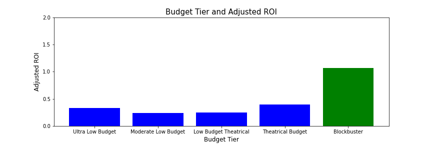

## Overview

We are looking to provide Microsoft with actionable information regarding high ROI studio projects for Microsoft's new streaming service. The analysis of variables such as budget level, gross box office, ROI, ROI by genre, movie ratings and IMDB ratings by director should help us in deducing useful insights. 

## Business Understanding

Some of the insights we hope to discover for Microsoft optimal budget levels, suggested genres that have a lower risk profile, and optimal directors and writers for this piece of work. 
Include stakeholder and key business questions
We plan to address concerns involving the risk profile of certain genres, 
-What sort of budget 
-What genre of films generate the highest ROI?
-How we efficiently find the right director and writer for this film?

## Data Understanding and Analysis

## Source of data

We are sourcing our data from several difference database vendors including: IMDB database, Rotten Tomatoes, Box Office Mojo, The MovieDB, and The Numbers. We received the data files in CSV, TSV and Zipped SQLite format. The IMDB SQLite file includes eight different tables, with each table having from two to eight columns. The CSV files incorporated data from The Movie Database, Box Office Mojo, and The Numbers. These files have anywhere from six to eleven columns and include key data such as gross box office, budget, and movie titles. The TSV files covers the Rotten Tomato data, having between nine to thirteen columns.

Our presentation, where we analyze our dataset can be found at:
["Win the Streaming Wars By Minimizing Production Risk"](https://docs.google.com/presentation/d/1eHM_7yCK9uwUq6WAfCs-Bu5rWZLCqV8IY08QTImrDhY/edit#slide=id.g130ecf64834_0_2)

## Description of data

Three visualizations (the same visualizations presented in the slides and notebook)

visualization_images/Ratings_and_Vote_unfiltered.png

 

## Conclusion

We found that investments in blockbusters produce a higher risk adjusted ROI than lower budget films. Romance is the most derisked genre, as even the failures (measured bu ratings) generate a profit. Choose the best rated directors that produce the highest number of votes (or "buzz"). A Christopher Nolan romance blockbuster coming soon to theaters near you!

